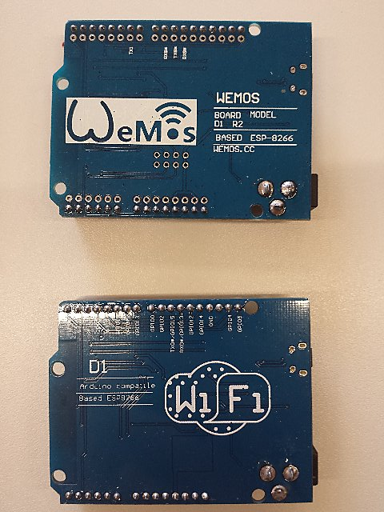

# Mikrocontroller am Beispiel Arduino - oder Der twitternde Farn

## Introduction
* We are using an [ESP8266](https://de.wikipedia.org/wiki/ESP8266)
  Microcontroller named **WeMos D1**.
  It comes in two revisions.

(Pictured: new revision R2 on top and old revision below)

## Installation

* Download Arduino IDE from https://www.arduino.cc/en/main/software
* Unpack and run
* Make the Arduino IDE familiar with your microcontroller:
  * Go to `File -> Preferences` and add the URL http://arduino.esp8266.com/stable/package_esp8266com_index.json under "Additional Board Manager URLs"
  * open `Tools -> Board: ... -> Board Manager`
  * search for "ESP8266" and select the matching driver below
  * click `install`
  * open `Tools -> Board: ...` and select "WeMos D1(Retired)" or "WeMos D1 R2 & mini" according to the name printed on your board
* USB setup:
  * Connect your Arduino board to the USB port of your computer and choose `Tools -> Port -> /dev/ttyUSB0`.
  * On Linux: `sudo chmod o+rw /dev/ttyUSB0` to enable read/write to that port as a normal user.
  You have to do this each time you disconnect and reconnect the microcontroller.

## First example: Switch off a LED on the board

The IDE shows two functions.
`setup()` is run once at the beginning (used for assigning start values to variables etc.).
`loop()` is run repeatedly.

* See [example01/example01.ino](example01/example01.ino).
* Click on the small check mark ("verify") on top to compile the code.
When it's done (and there are no errors) it will show "Done compiling."
* Upload the compiled code to the board using the arrow button (2nd from left).
If it works, you should see

        Uploading 227200 bytes from /tmp/build097a90998118e101b31481be08ada238.tmp/example01.ino.bin to flash at 0x00000000
        ................................................................................ [ 36% ]
        ................................................................................ [ 72% ]
        ..............................................................                   [ 100% ]

The LED labelled `SCK` goes off.

You can now control the brightness of your LED with the `MEIN_LED` value.

## Second example: Make the LED blink

* See [example02/example02.ino](example02/example02.ino).
  * Verify and upload the code.
  * The LED will blink.

* Bonus: [example02a/example02a.ino](example02a/example02a.ino).
The LED changes brightness each 500 ms and goes off for 1 second.

## Third Example: Control the LED with a light sensor

(You need a board with a light sensor to run this, e.g. Arduino Mega ADK.
Make sure you pick the right board on `Tools -> Board: ...`)

* See [example03/example03.ino](example03/example03.ino).
  * This program turns on the LED on the board when it's dark, and off when
    it's bright.
* Click the `Serial Monitor` icon on the upper right corner of the IDE to see
  the output of the serial console of your Arduino.

## Fourth example: Humidity sensor setup

* See [example04/example04.ino](example04/example04.ino).
* Assemble the humidity sensor.
* Disconnect the microcontroller from the computer (!).
* Connect the humidity sensor curcuit board to the microcontroller
  * VCC --> 3.3V
  * GND --> GND
  * AO (analog output) --> AO
* Connect the controller to the computer again and put the sensor into the
  flower pot.
* You can now watch the humidity values of the flower pot and other things.
  * The values range from 0 to ~1000.
  * High values mean it's dry, low values mean it's humid.

## Fifth example: Control the LED with the humidity sensor

* See [example05/example05.ino](example05/example05.ino).
* The LED should blink for 5 seconds when it's too dry.

## Sixth example: Add measuring interval for humidity sensor

* When you measure, there's electric current going through the sensor
  permanently.
  This decreases the lifetime of the sensor.
* Our idea: Measure only once in a certain interval.
* How do we achieve this? We measure only once every 1/5 second and switch off
  the sensor in between (when it's not needed).
  * Disconnect the Arduino from the computer.
  * Take the wire connected to 3.3V on the microcontroller and connect it to
    D8 (old rev) or D3 (new rev).
  * Reconnect the Arduino to the computer.
* See [example06/example06.ino](example06/example06.ino).

## Seventh example: WiFi setup and web server

* See [example07/example07.ino](example07/example07.ino).
  * Connect Arduino to a WiFi
  * Arduino should output its IP address to the serial console:

          I'm Arduino, trying to connect to the Wifi blubb blubb blubb blubb blubb \
          blubb blubb blubb blubb blubb blubb blubb blubb blubb blubb blubb blubb \
          blubb blubb blubb blubb blubb blubb successfully connected!
          10.42.0.130

  * Ping Arduino from your computer to test connectivity

          $ ping 10.42.0.130
          PING 10.42.0.130 (10.42.0.130) 56(84) bytes of data.
          64 bytes from 10.42.0.130: icmp_seq=1 ttl=128 time=23.8 ms
          64 bytes from 10.42.0.130: icmp_seq=2 ttl=128 time=16.5 ms
          64 bytes from 10.42.0.130: icmp_seq=3 ttl=128 time=11.8 ms

  * Start a web server on Arduino

Using a command line/shell, try to access the Arduino web server at the given
URL

    $ curl 10.42.0.130
    Guckuck!

The serial console of the Arduino IDE will display

    GET / HTTP/1.1
    Host: 10.42.0.130
    User-Agent: curl/7.50.1
    Accept: */*

Our web server is working!
